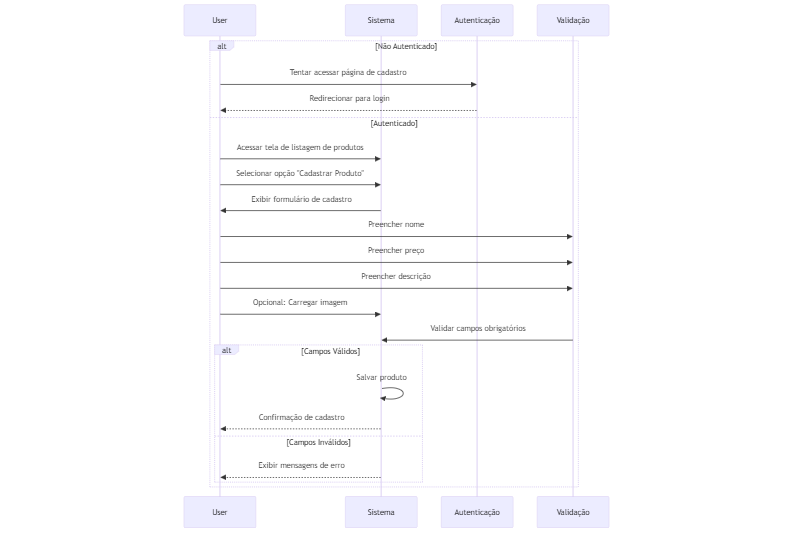

# 📚 Documentação da API - 📓 Guia de Uso

Explore a documentação:

🏁 [Introdução (README.md)](../README.md)  | ⚙️ [Instalação](INSTALL.md) | 📓 [Guia de Uso](USAGE.md) | 🖥️ [API](API.md)

### Nesta seção, você encontrará todas as informações necessárias sobre como funciona o fluxo das funcionalidades do projeto.

---

## 📦 Produtos

#### 1. Cadastrar Produto
- Esta opção esta disponível na tela de listagem de produtos;
- O usuário deverá preencher o campo nome;
- O usuário deverá preencher o campo de preço;
- O usuário poderá preencher o campo de imagem;
- O usuário deverá preencher os campos obrigatórios (descrição e preço)*;
- O usuário precisar estar logado para acessar a página*;

#### 2. Editar Produto
- Esta opção esta disponível na tela de listagem de produtos;
- O usuário deverá alterar o campo nome;
- O usuário deverá alterar o campo de preço;
- O usuário poderá alterar o campo de imagem;
- O usuário deverá preencher os campos obrigatórios (descrição e preço)*;
- O usuário precisar estar logado para acessar a página*;

#### 3. Deletar Produto
- Esta opção esta disponível na tela de listagem de produtos;
- O usuário precisar estar logado para acessar essa opção*;

#### 4. Listar Produtos
- Produtos serão listados na tela;
- A listagem pode ser filtrada por nome do produto;

## 🤝 Clientes

#### 1. Cadastrar Cliente
- Esta opção esta disponível na tela de listagem de clientes;
- O usuário deverá preencher o campo nome;
- O usuário deverá preencher o campo email;
- O usuário deverá preencher o campo cidade;
- O usuário poderá preencher o campo de imagem;
- O usuário deverá preencher os campos obrigatórios (nome, email, cidade)*;
- O usuário precisar estar logado para acessar a página*;
- Não é possivel cadastrar clientes com email já cadastrado;

#### 2. Editar Cliente
- Esta opção esta disponível na tela de listagem de clientes;
- O usuário deverá alterar o campo nome;
- O usuário deverá alterar o campo email;
- O usuário deverá alterar o campo cidade;
- O usuário poderá alterar o campo de imagem;
- O usuário deverá preencher os campos obrigatórios (nome, email, cidade)*;
- O usuário precisar estar logado para acessar a página*;
- Não é possivel atualizar email já cadastrado;

#### 3. Deletar Cliente
- Esta opção esta disponível na tela de listagem de clientes;
- O usuário precisar estar logado para acessar essa opção*;

#### 4. Listar Clientes
- Clientes serão listados na tela;
- A listagem pode ser filtrada por nome ou email do cliente;

## 📈 Vendas

#### 1. Cadastrar Venda
- Esta opção esta disponível na tela de listagem de vendas;
- O usuário deverá preencher o campo cliente;
- O usuário deverá preencher o campo produto;
- O usuário deverá preencher o campo quantidade;
- O usuário deverá preencher os campos obrigatórios (cliente, produto, quantidade)*;
- O usuário precisar estar logado para acessar a página*;

#### 2. Editar Venda
- Esta opção esta disponível na tela de listagem de vendas;
- O usuário deverá alterar o campo cliente;
- O usuário deverá alterar o campo produto;
- O usuário deverá alterar o campo quantidade;
- O usuário deverá preencher os campos obrigatórios (cliente, produto, quantidade)*;
- O usuário precisar estar logado para acessar a página*;

#### 3. Deletar Venda
- Esta opção esta disponível na tela de listagem de vendas;
- O usuário precisar estar logado para acessar essa opção*;

#### 4. Listar Vendas
- Vendas serão listados na tela;
- A listagem pode ser filtrada por cliente ou produto;

## 📊 Dashboard

#### 1. Dados
- O usuário podera ver dados como:
  - Quantidade de vendas;
  - Quantidade de clientes;
  - Quantidade de produtos;
  - Valor total de vendas;
  - Valor total de produtos;
  - Media de vendas por cliente;
  - Media de vendas por produto;

